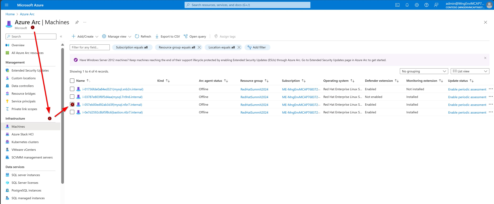

:numbered:

= Convert To RHEL with Azure Arc

== Overview
In this workshop you will convert a Centos 7 system into a Red Hat Enterprise Linux 7 system.

This lab has two Centos VMs: One Apache and one Mysql.

In this lab you will:

* Install the Azure Arc client on both Centos VMs
* Convert2Rhel both Centos VMs
* Reboot VMs
* Validate the Web App still work
* Discuss security and conversion technical issues

== Lab Access

. Access your *httpd server VM* with the following command.
+
[source,bash,subs="attributes",role=execute]
----
{web_host_ssh_command}
----
+
.`devops` user password
[source,bash,subs="attributes",role=execute]
----
{web_host_ssh_password}
----

. Access your *database server VM* with the following command.
+
[source,bash,subs="attributes",role=execute]
----
{database_host_ssh_command}
----
+
.`devops` user password
[source,bash,subs="attributes",role=execute]
----
{database_host_ssh_password}
----

== Verify the Web App is Running

. Browse to http://{web_app_url}[Sample Web App] to verify the web app is running.
+
Sample Output

== Run Azure Arc Commands on Both VMs

Azure Arc enables the managment and monitoring of infrastrucutre such as RHEL Servers and OpenShift deployemnts that are deployed on-premsies or in mulit-cloud enviroments. For this lab we pre-created the installation script using a service principal that will connect the AWS VM to Azure Arc. Once the script is executed, the connected VM will display in the Azure portal.

. Switch to root user.
+
[source,bash,role=execute]
----
sudo -i
----

. Change into the home directory of root
+
[source,bash,role=execute]
----
cd /root
----

. Execute the Arc connection sript named deploy_arc.sh
+
[source,bash,role=execute]
----
./deploy_arc.sh
----

The azcmagent-1.39.02628-1431.x86_64 will be installed and the VM Arc resource will be associated with the resource group called RedHatSummmit2024. You can verify the agent and its dependencies are installed in the /opt/azcmagent/bin folder.

== Run the Convert2RHEL Commands on Both VMs

Now we'll actually do the Centos to RHEL conversion.

=== Enabling the Convert2RHEL repository

The Convert2RHEL RPM is an offical Red Hat package. 
Therefore it is readily availble from the Red Hat software repository (CDN). 
As your CentOS server is not subscribed to the Red Hat CDN, you will need to enable the Convert2RHEL repository.

. Get the GPG signing key
+
[source,bash,role=execute]
----
curl -o /etc/pki/rpm-gpg/RPM-GPG-KEY-redhat-release https://www.redhat.com/security/data/fd431d51.txt
----

. Download the SSL certificate
+
[source,bash,role=execute]
----
curl --create-dirs -o /etc/rhsm/ca/redhat-uep.pem https://ftp.redhat.com/redhat/convert2rhel/redhat-uep.pem
----

. Download the convert2rhel repository file
+
[source,bash,role=execute]
----
curl -o /etc/yum.repos.d/convert2rhel.repo https://ftp.redhat.com/redhat/convert2rhel/7/convert2rhel.repo
----

=== Installing the Convert2RHEL utility
 
Now that the requisite repository is enabled on your CentOS Linux system, it is time to install the Convert2RHEL utility and prepare the system for conversion.

. Before you begin the installation process, verify that you are running CentOS Linux and on the latest minor version.
+
[source,bash,role=execute]
----
cat /etc/centos-release
----

. Verify that the Convert2RHEL repo is enabled.
+
[source,bash,role=execute]
----
yum repolist
----

. Install the convert2rhel utility.
+
[source,bash,role=execute]
----
yum install -y convert2rhel
----

== Run the Convert2RHEL utility

. Before running the Convert2RHEL utility, you need to tell it to ignore the unknown or incompatible kernel modules.
The Microsoft kernel modules are not known to the conversion system.
Execute the following to put the override flag into your environment permanently.
.. Allow unknown Modules varaible
+
[source,bash,role=execute]
----
echo "CONVERT2RHEL_ALLOW_UNAVAILABLE_KMODS=1" >> ~/.bashrc
----

.. Skip Tainted Kernel Modules varaible
+
[source,bash,role=execute]
----
echo "CONVERT2RHEL_TAINTED_KERNEL_MODULE_CHECK_SKIP=1" >> ~/.bashrc
----

.. Skip Kernel Currencey Check varaible
+
[source,bash,role=execute]
----
echo "CONVERT2RHEL_SKIP_KERNEL_CURRENCY_CHECK=1" >> ~/.bashrc
----

.. Skip Outdated Package Check varaible
+
[source,bash,role=execute]
----
echo "CONVERT2RHEL_OUTDATED_PACKAGE_CHECK_SKIP=1" >> ~/.bashrc
----

.. Now Load the varaible into the shell

+
[source,bash,role=execute]
----
source ~/.bash_profile
----

.. Now export the variables so they can be used by sub-process of the convert2rhel conversion utility

+
[source,bash,role=execute]
----
export CONVERT2RHEL_TAINTED_KERNEL_MODULE_CHECK_SKIP; export CONVERT2RHEL_ALLOW_UNAVAILABLE_KMODS; export CONVERT2RHEL_SKIP_KERNEL_CURRENCY_CHECK; export CONVERT2RHEL_OUTDATED_PACKAGE_CHECK_SKIP
----

. In order to automate this process, you need to use activation key in the conversion command.
+
[source,bash,role=execute]
----
convert2rhel --org 12451665 --activationkey convert2rhel -y
----
+
NOTE: This process takes some time! The above process ask to confirm at several steps. Adding a `-y` as an argument will automate the input. 

. Now that the conversion has been deployed successfully, you will need to reboot the system in order to put the changes into effect.
+
[source,bash,role=execute]
----
reboot
----

. Verify the system is running on Red Hat Enterprise Linux.
+
[source,bash,role=execute]
----
cat /etc/redhat-release
----

. Verify that the necessary Red Hat repositories are enabled. Also, note that none of the old CentOS repos are available.
+
[source,bash,role=execute]
----
yum repolist
----

. Now you can review the logs from the conversion itself.
+
[source,bash,role=execute]
----
less /var/log/convert2rhel/convert2rhel.log
----

. Verify the Web Application still functions by browsing to http://{web_app_url}[Sample Web App] to verify the web app is running.
+
.Sample Output
----
id: 1 - Word: example 83
----

== Congratulations!

You have converted from Centos to RHEL, and it's displayed in Arc on the instructors main screen.

. Optional Lab

Log into Azure portal.

NOTE: In order to log into the Azure portal, you will need user credentials which you can obtain from lab instructors.

. Logging into the Azure portal requires the use of Azure Authenticator which can be installed on your mobile device.
. Once logged into the Azure portal you can navigate to a few key areas

* Arc resource blade and find the Infrastructure section and click on Machines to find your VM's connected via Azure Arc

* Once you have chosen a specfic VM from the Mahcines list, you can deploy additional extentions sush as Custom Script Extenstion for Linux, assign polices to the VM, or enable Monitor insights which will allow you to view and create reports such as VM performance and workload networkign mapping.   

== Notes from the field:

Convert2Rhel can fail to complete for a varity of reasons, such as 3rd party packages which are not offically supported by Red Hat. In some cases there will be just a simple warning that a specfic package will not be replaced during the conversion process and the converion process will still complete. It is recommneded to check to see if the package that was skipped to ensure proper operation after the conversion and the kernel is updated and loaded.

In other cases the conversion process will initiate a roll back to the state it was before running the conversion. In these cases, you will need to either remidiate the issue such as removing the package, unloading the module from starting or changing enviromental variables that will skip the process in the conversion process.

The most common enviromental variables:

** Solution 1: `echo "CONVERT2RHEL_ALLOW_UNAVAILABLE_KMODS=1" >> ~/.bashrc`
** Solution 2: `echo "CONVERT2RHEL_TAINTED_KERNEL_MODULE_CHECK_SKIP=1" >> ~/.bashrc`
** Solution 3: `echo "CONVERT2RHEL_SKIP_KERNEL_CURRENCY_CHECK=1" >> ~/.bashrc`
** Solution 4: `echo "CONVERT2RHEL_OUTDATED_PACKAGE_CHECK_SKIP=1" >> ~/.bashrc`
